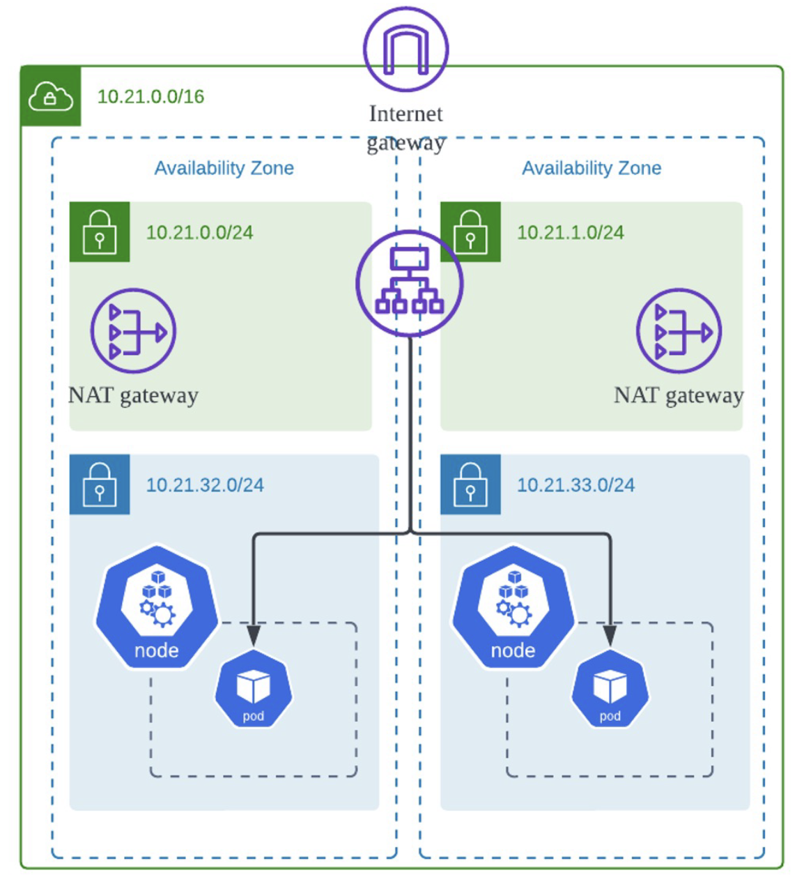

# 🚀 Terraform을 사용한 AWS EKS & Spring Boot 배포


---

## **🛠 프로젝트 개요**  
이 프로젝트는 **Terraform을 사용하여 AWS 인프라(VPC, EKS)를 자동으로 구축**하고,  
**Spring Boot 애플리케이션을 컨테이너화하여 EKS에 배포**하는 예제입니다.  

---

## **📂 기술 스택**  
- **Infrastructure:** Terraform, AWS VPC, AWS EKS, AWS ECR, NAT Gateway  
- **Containerization:** Docker, Kubernetes  
- **Application:** Spring Boot, REST API  
- **Networking:** AWS ALB, Private & Public Subnets  

---

## **📂 폴더 구조**
```bash
📦 terraform-eks-springboot
├── README.md                      # 프로젝트 설명 및 사용법 문서
├── app/                           # Spring Boot 애플리케이션 코드
│   ├── Dockerfile                 # Docker 빌드 파일 (애플리케이션 컨테이너화)
│   ├── pom.xml                    # Maven 빌드 및 의존성 설정 파일
│   ├── src/                       # 애플리케이션 소스 코드 및 테스트 코드
│   └── target/                    # Maven 빌드 결과물 (컴파일된 파일, JAR 파일 등)
├── images/                        # 다이어그램 및 시각적 자료
│   └── diagram.png                # 네트워크 아키텍처 다이어그램
├── k8s/                           # Kubernetes 리소스 파일
│   ├── deployment.yaml            # Spring Boot 애플리케이션 배포 설정
│   └── service.yaml               # ALB를 통한 LoadBalancer 서비스 설정
├── terraform/                     # Terraform 코드 (AWS 인프라 설정)
    ├── eks.tf                     # EKS 클러스터 및 노드 그룹 설정 파일
    ├── outputs.tf                 # Terraform 출력 변수 설정
    ├── provider.tf                # AWS Provider 설정 파일
    ├── terraform.tfstate          # Terraform 상태 파일 (현재 인프라 상태 기록)
    ├── terraform.tfstate.backup   # Terraform 상태 파일의 백업
    ├── variables.tf               # 변수 선언 및 기본값 설정
    └── vpc.tf                     # VPC 및 네트워크 인프라 설정
```

---

## 🌍 AWS 인프라 구성
### **📌 1. Terraform으로 AWS VPC 및 EKS 구축**
1️⃣ Terraform 환경 설정
Terraform이 설치되어 있어야 합니다. 설치 방법은 Terraform 공식 문서에서 확인할 수 있습니다.
```
terraform init
terraform apply -auto-approve
```
📌 이 명령어를 실행하면 VPC, Subnet, NAT Gateway, EKS 클러스터 및 노드 그룹이 자동으로 생성됩니다.


2️⃣ kubeconfig 업데이트
```
aws eks update-kubeconfig --name core-eks --region ap-northeast-2
```
✅ kubectl get nodes를 실행하여 EKS 클러스터에 정상적으로 연결되었는지 확인합니다.

---

### **📌 2. 네트워크 구성 (VPC, Subnet, NAT Gateway)**
아래 다이어그램을 참고하여 VPC, 서브넷 및 NAT Gateway를 구성합니다.



📌 네트워크 구성 요소
* Public Subnet → ALB와 인터넷 게이트웨이 연결
* Private Subnet → EC2 및 EKS 노드 배치, NAT Gateway를 통해 외부 통신 가능
* NAT Gateway → Private Subnet에서 인터넷으로 나갈 때 사용

---

### **📌 3. Spring Boot 애플리케이션 Docker 이미지 빌드 & ECR 푸시**
1️⃣ Spring Boot 애플리케이션을 Docker 이미지로 빌드
```
docker build -t spring-boot-app .
```
2️⃣ AWS ECR에 업로드
```
aws ecr create-repository --repository-name spring-boot-app

docker tag spring-boot-app:latest <AWS_ACCOUNT_ID>.dkr.ecr.ap-northeast-2.amazonaws.com/spring-boot-app:latest

aws ecr get-login-password --region ap-northeast-2 | docker login --username AWS --password-stdin <AWS_ACCOUNT_ID>.dkr.ecr.ap-northeast-2.amazonaws.com

docker buildx build --platform linux/amd64,linux/arm64 -t <AWS_ACCOUNT_ID>.dkr.ecr.ap-northeast-2.amazonaws.com/spring-boot-app:latest --push .
```
✅ ECR에 이미지를 업로드한 후, Kubernetes에서 이를 사용하여 배포할 수 있습니다.

---

### **📌 4. Kubernetes를 사용하여 EKS에 애플리케이션 배포**
1️⃣ Deployment 및 Service 적용
```
kubectl apply -f k8s/deployment.yaml
kubectl apply -f k8s/service.yaml
```
2️⃣ 배포 확인
```
kubectl get pods
kubectl get svc
```
✅ 서비스가 LoadBalancer 타입이라면, EXTERNAL-IP를 통해 애플리케이션에 접근할 수 있습니다.

---

### **📌 5. EKS에서 애플리케이션 배포 전략**
📌 배포된 Spring Boot 애플리케이션은 Private Subnet에 위치한 노드에서 실행됩니다. 

📌 affinity 옵션을 활용하여 Private Subnet에 배치된 노드에 배포되도록 설정할 수 있습니다. 

📌 ALB(Application Load Balancer)를 사용하여 외부에서 접근 가능하도록 구성합니다.

---

### **📌 6. 마무리**
이 프로젝트는 Terraform을 사용하여 AWS 인프라를 자동으로 구축하고,
Spring Boot 애플리케이션을 컨테이너로 패키징하여 AWS EKS에 배포하는 방법을 다룹니다.

✅ 완전 자동화된 AWS EKS + Spring Boot 배포 인프라 구축
✅ Private & Public Subnet을 활용한 네트워크 아키텍처 설계
✅ Terraform을 사용한 인프라 자동화 및 관리 용이

기여 및 피드백 환영합니다! 😊

